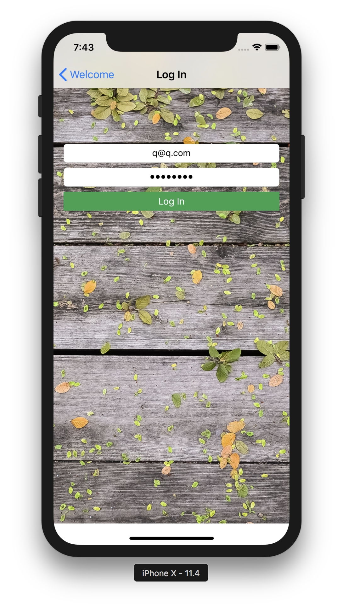
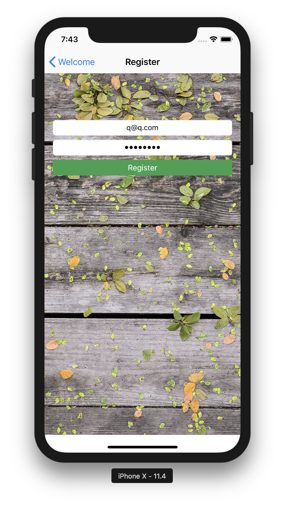
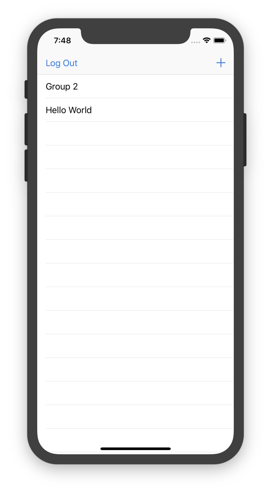
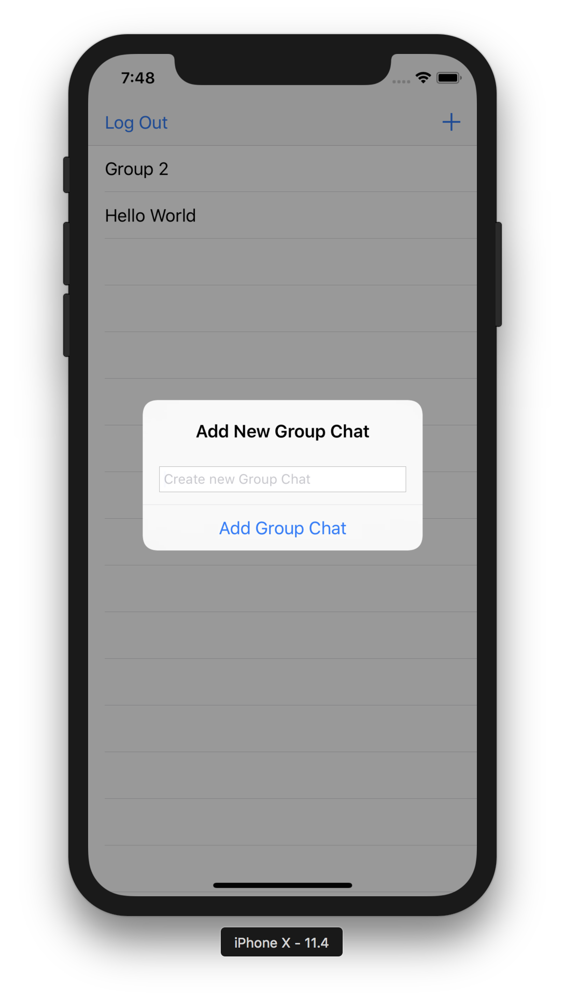
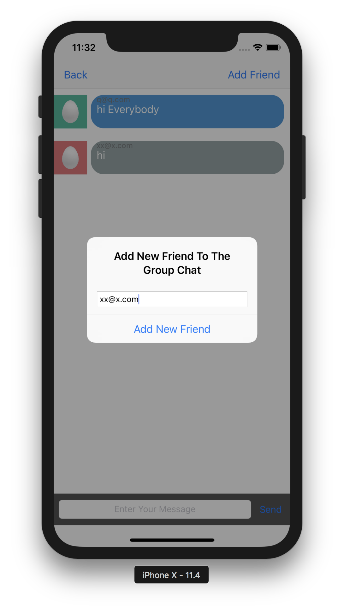
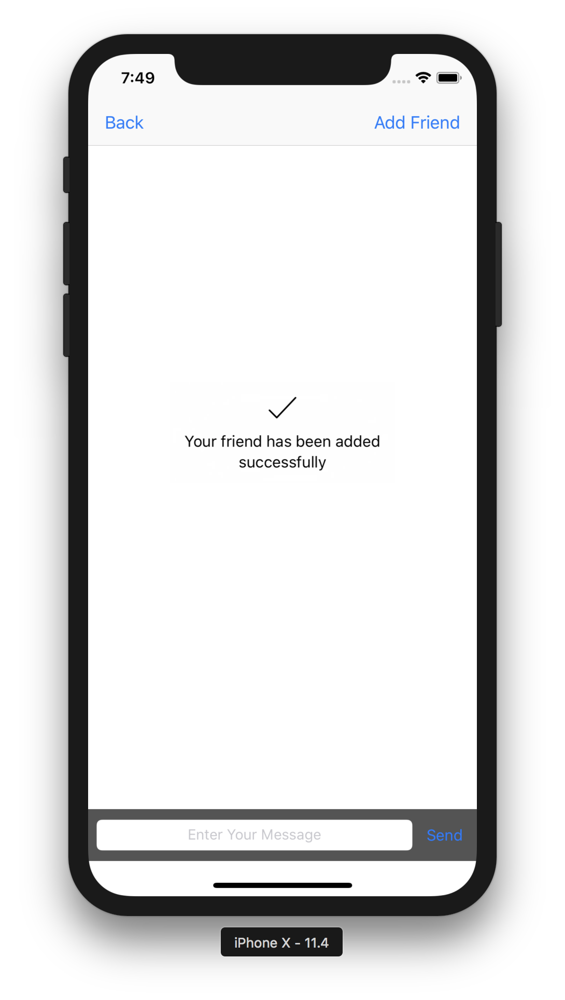
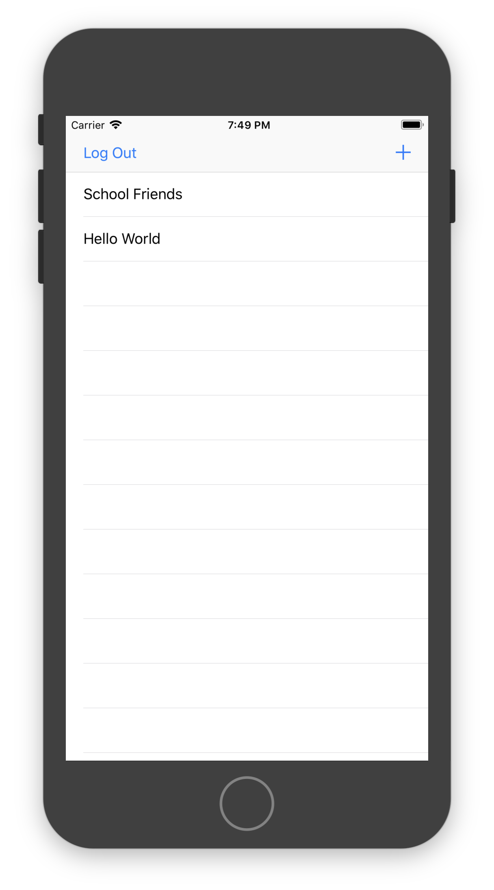
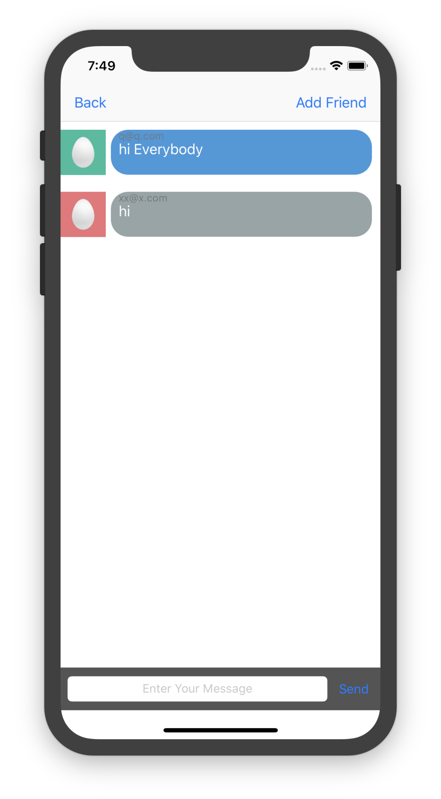
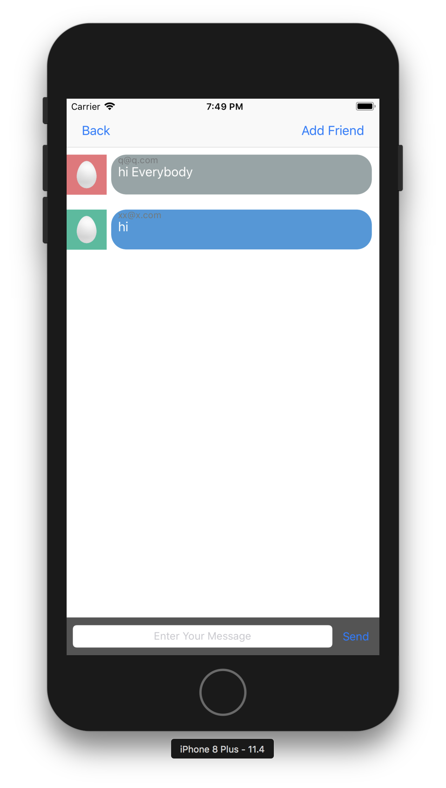

# Flash-Chat

IOS application which enables the user to create online chat rooms and send messages. Firebase is used to host the database.

Table of contents
=================

<!--ts-->
   * [Technologies Used And Cocoapods.](#technologies-used-and-cocoapods)
   * [Prerequisites](#prerequisites)
   * [Installation](#clone)
   * [User Guide](#user-guide)
      * [Sign Up And Sign In](#sign-up-and-sign-in)
      * [Create Group Chat](#create-group-chat)
      * [Add Friend To Your Group Chat](#add-friend-to-your-group-chat)
      * [Send Messages](#send-messages)
   * [License](#license)
<!--te-->

Technologies Used And Cocoapods:
===========

  - Swift 4.0 and Xcode 9.0 are used to implement this project.
  - Fire base is used to host the database and track the messages between users.
  - SVProgressHUD is used to show load ring and error messages.
  - ChameleonFramework is used to get different nice colours.
  
Prerequisites:
=============

  - You Should have MacOS (operation system supported by apple.
  - Xcode IDE.

Clone:
=====
  Clone this repo `https://github.com/shazly333/Flash-Chat.git`
  
User Guide:
===========

  Sign up and Sign in:
  --------------------
  
  - To sign up, press Register buttom in the home view, then enter your email and password and press Register.
  - To sign in, press Log In buttom in the home view, then enter your email and password and press Log In.
   

  
    
    
  

  
  Create Group Chat:
  ------------------

  - To create a new group chat press on the plus button on the upper right of side the screen then enter the name of your new group chat and it will appear on the list of your groups chat.
  - To open group chat room jusr press on its name on the list.
    
      

         
         
        
          
       

  
  Add Friend to your group chat:
  -----------
  
  - To add new friend to your group chat, press on the Add Friend button on the upper right side of the screen then enter the email of your friend (you can add more friends as you want).
    
    

      
    

  - If this email exists, this message will appear.
  
   

      
   

    
  - If this email not found, error message will appear.
    
     

        
    

    
   - When your friend login in he will find your group chat was added to his group list.
    
       

          
      

      
  Send Messages:
  ---------------
  
  - To send a message you should write you message in the text field in the bottom then press the button beside it.
  - Messages you sent will appear in blue but your friends messages will appear in gray.
      
      

          
          
      

   
License:
=======

Copyright (c) 2018 Mohamed Kamal El-Shazly
